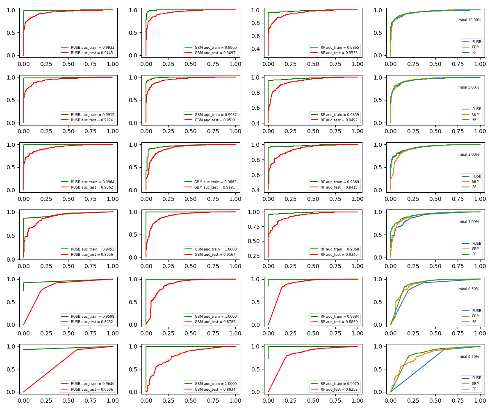

# Learning from imbalanced datasets

Many real-world datasets feature class imbalance. That is, the ratio of minority to majority class instances
is < 1.0. The topic of imbalanced class classification has received significant coverage in books, papers,
special issues and popular blogs. There is a reasonable consensus on a researcher's options when faced
with imbalanced data classification. But there is good bit of uncertainty (and debate) about the point
at which class imbalance should be considered an issue. Many studies on the subject choose to illustrate
their particular method by choosing synthetic or published datasets which feature class imbalance ratios
\>= 1.5 % (i.e. >= 0.015). There is some [discussion](https://stats.stackexchange.com/a/133385/92277)
which hints that class population ratio ought to be around 0.999/0.001 to really count as imbalanced.

High quality manufacturing processes often give rise to class imbalances in the 0.1 % -- 0.01 % range. Published
papers rarely simulate these extreme levels of class imbalance. Also many recent studies consider unrelated
methods for comparison. For example [this paper](https://bit.ly/2JkbmKN) develops RusBoost, a tree-based
boosting algorithm and compares to Naive Bayes, AdaBoost and SMOTE, but doesnt compare the new algorithm with Random
Forests (RF) or GBM, which would be our goto alternatives. Also the paper only goes down to imbalance level
of 1.3%. The goal of this study is therefore three-fold. (a) implement RusBoost from scratch by extending
scikit-learn (b) compare RusBoost to RandomForest and GBM, to algorithms which perform well in imbalance
situations and (c) take the comparison down to 0.2% level (5x lower than the minimum considered in the paper).

The disclaimer obviously is that this is not a comprehensive comparison. We've considered
the diversity of neither the datasets nor the metrics. We consider only one dataset (the
`SATIMG` dataset from UCI) and get different imbalance ratios by downsampling the minority
class. Given more time, the natural thing to do would be to run the tests on other datasets.

The figure below shows the results of comparison using the ROC curve and area under the ROC curve (AUC)
as the metric of choice. The imbalance ratio is varied from 10% to 0.2% along the rows. It is clearly seen
that Random Forest (with `class_weight='balanced'`) and GBM continue to function okay down to smallest
imbalance ratios considered. RUSBoost, on the other hand, is faster and also performs reasonably well down
to imbalance ratio ~ 1%, but is qualitatively less robust to extreme imbalance ratios than RF and GBM. I do
not want to risk drawing too strong a conclusion from just one dataset, but it is a good to our intuition.

 

